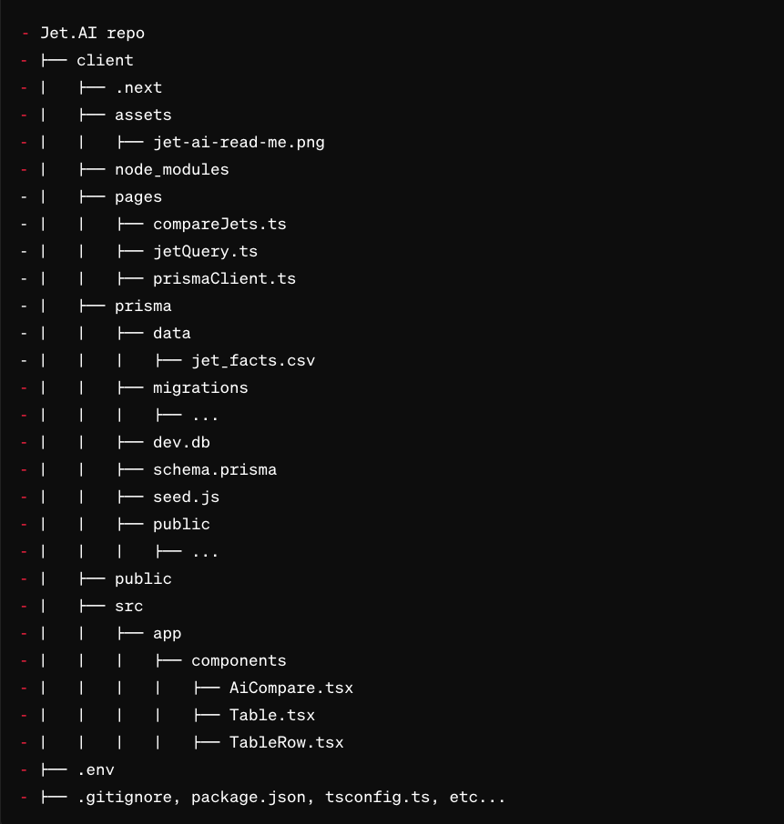

# Jet.AI

 <p align="center">
  
</p>

- **Clone** the repository to get started.

- First please cd in the client directory and install all dependencies.

```bash
cd client
```

```bash
npm install
```

- Next seed the SQLite database with the this command:

```bash
npm run prisma:seed
```

- In a separate terminal feel free to cd into client again and open up Prisma Studio to ensure all data is correctly seeded with this command:

```bash
npx prisma studio
```

- Run the dev server with this command:

```bash
npm run dev
```

- This will open http://localhost:3000/ where we can view the app.

  
- The "Jet Comparison Tool" project aims to develop a comprehensive web application utilizing TypeScript for both frontend and backend development. The backend utilizes Prisma with a SQL database to manage jet data and comparisons through RESTful API endpoints. Even though I do use the term "backend" this app runs serverless. I chose to use SQLite for its lightweight nature and its local-first approach.

- The frontend, built with Next.js, includes a landing page displaying information on the top 10 charter jets, offering users the ability to compare selected jets based on criteria like top speed, fuel efficiency, or maximum seats using AI. The UI incorporates TailwindCSS for styling, facilitating dynamic data display and interactions. 

- Testing and documentation are prioritized to ensure functionality across different browsers, with comprehensive setup instructions and project overview provided in the README.md file.


 <p align="center">
  
</p>

